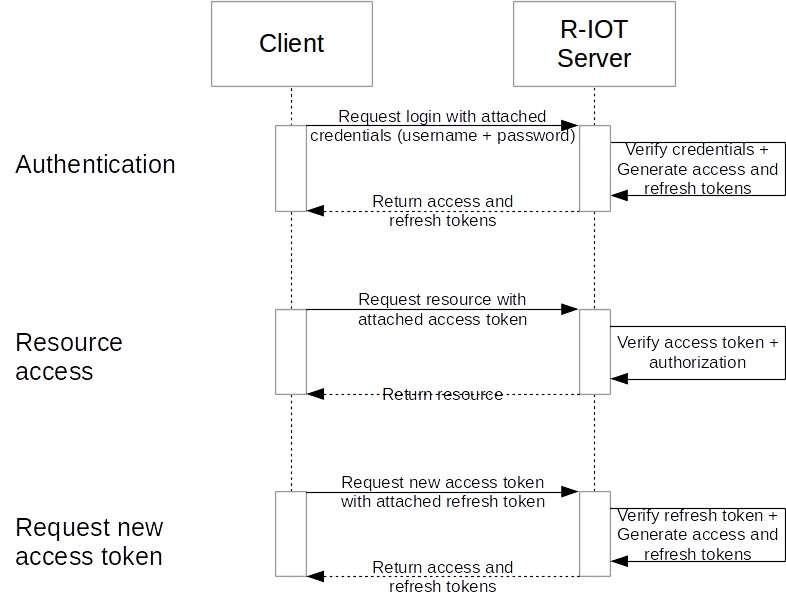

# Authentication

## Basics
The authentication process for a RESTful API is different from the authentication process when for example using a website. This is because a **RESTful API should be stateless** and therefore no server side session should be maintained for each user. This is part of the architectural constraints introduced by the REST architectural style which improves the scalability capabilities.

The stateless approch does need another way of keeping track of the already authenticated users. This is usually achived through an **access tokens**. The access token is simirally to the session id in statefull services, a way of identifing the user. In the authentication process the user will send the credentials to the server. The server will verify these credentials, **generate an unique access token, save this token on the server and return this token to the user**. The user can than use the token when requesting a resource via the RESTful API by sending the token along with the request. The server is than able to identify the user based on the token and grant or deny access based on **further authorization rules** associated with the user or the token.

This aproach is **widely accepted** in the web and supported by a lot of big internet companies. It is easy to use by developers who are working with the RESTful API and considered a reasonable techique for securing a RESTful API.

## OAuth
When working with the token based approch the most services use the **OAuth standard for authorization**. The OAuth standard describes the protocol for how the authentication process should be realized. A standard in this regard introduces a unified workflow when authenticating with different services. This simplifies the development for the developers who are using the services as a client.

The OAuth standard is not only for client-server authenficiation but also for authenficiation of a third party. The latter case is actually the main reason the OAuth protocol is used. It allows the authenficiation of a service against another service to access the users resources.

## R-IOT Authentication Process
Since the OAuth protocol has more capabilites than are actually needed by the R-IOT project, we introduce a **simplified version of the OAuth protocol**. The process is similar to the OAuth client-credential authentification process and therefore the already described basic token based approch.

The basic concept of the token based approach is simple, but introduces a gread security risk, if the token would be valid without any timeout. Therefore the advanced concept of an **refresh token** will be used similar to the OAuth protocol. When an access token is generated on the server, a refresh token will be generated and returned to the user along with the access token. The **access token has a timeout** until the access token will be revoked. The refresh token will be valid until the user requests a logout or is used in the process of requesting a new access token. If the access token was revoked, the **client can use the refresh token to request a new access token**. This improves the security of the application on the cost of a more complex client implementation.

The following diagramm describes the high level flow.

