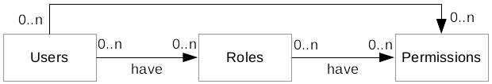

# Authentication and Authorization
TODO brief introduction

## Authentication
This section describes the authentication process of the R-IOT system. First the basic concept of the authentication will be described, followed by the high level overview of the R-IOT system and the usage in code for securing a REST API.

### Concept
The authentication process for a RESTful API is different from the authentication process when for example using a website. This is because a **RESTful API should be stateless** and therefore no server side session should be maintained for each user. This is part of the architectural constraints introduced by the REST architectural style which improves the scalability capabilities.

The stateless approach does need another way of keeping track of the already authenticated users. This is usually achieved through an **access tokens**. The access token is similarly to the session id in statefull services, a way of identifying the user. In the authentication process the user will send the credentials to the server. The server will verify these credentials, **generate an unique access token, save this token on the server and return this token to the user**. The user can than use the token when requesting a resource via the RESTful API by sending the token along with the request. The server is than able to identify the user based on the token and grant or deny access based on **further authorization rules** associated with the user or the token.

This approach is **widely accepted** in the web and supported by a lot of big internet companies. It is easy to use by developers who are working with the RESTful API and considered a reasonable technique for securing a RESTful API.

When working with the token based approach the most services use the **OAuth standard for authorization**. The OAuth standard describes the protocol for how the authentication process should be realized. A standard in this regard introduces a unified workflow when authenticating with different services. This simplifies the development for the developers who are using the services as a client.

The OAuth standard is not only for client-server authentication but also for authentication of a third party. The latter case is actually the main reason the OAuth protocol is used. It allows the authentication of a service against another service to access the users resources.

### High-Level View
Since the OAuth protocol has more capabilities than are actually needed by the R-IOT project, we used a **simplified version of the OAuth protocol**. The process is similar to the OAuth client-credential authentication process and therefore the already described token based approach where a username and password is used for the authentication and generation of a token.

The basic concept of the token based approach is simple, but introduces a great security risk, if the token would be valid without any timeout. Therefore the advanced concept of an **refresh token** will be used similar to the OAuth protocol. When an access token is generated on the server, a refresh token will be generated and returned to the user along with the access token. The **access token has a timeout** until the access token will be revoked. The refresh token will be valid until the user requests a logout or is used in the process of requesting a new access token. If the access token was revoked, the **client can use the refresh token to request a new access token**. This improves the security of the application on the cost of a more complex client implementation.

The following diagram describes the high level flow of the authentication process.

### Developer View
This section will describe how the authentication can be added to an already existing REST API. The **required technology** for RESTful web services must be the [Jersey framework](https://jersey.java.net/) in order to integrate seamlessly with the Jersey API based on the JAX-RS specification.

The process of requiring an authenticated user is as simple as the Jersey API itself. The authentication can be added through a simple **annotation**. See the following example of a simple REST service.

    @GET
    @Path("/users")
    @RequiresAuthentication
    public Collection<UserResponse> getUsers() {
        return dao.getUsers();
    }

The `@RequiresAuthentication` annotation will secure the API call from unauthenticated users. It can't get any simpler than that! If an unauthenticated user tries to access the API, an automatic HTTP response with status code **401 Unauthorized** will be returned and your code will never be executed.

## Authorization
This section will describe the authorization process based on an already authenticated user.

### High-Level View
The authorization process will **grant or deny access to an already authenticated user based on roles an permissions**. Specific parts of the API can therefore be excluded from access of different users. Each role has assigned a collection of permission and a roles are assigned to users. See the following diagram.

**Roles** are really straight forward just a name for a group of users which have specific rights. But roles itself should not imply specific rights where someone would often think in such a way. For example the administrator role itself often implies that this role is allowed to create new users. A normal user itself would maybe not have this right. The implication of the right is based on just the name of the role not actual specified rights. It is possible to think in such a way, but this will result in more static authorizations where change will have a major impact on the system. For the actual rights of specific roles the permissions are used.

**Permissions** are the most atomic level and describe the actual rights a specific role has. They often represent the common actions on resources, such as create, read, update, and delete. These permissions can have different levels of granularity. There is the **resource level** (*User is allowed to create a new calendar entry*), the **instance level** (*User can only update the own user data*) and **attribute level** (*User can update the own username*).

**Example roles:**
- Administrator
- Support
- User

**Example permission:** 
- read users
- update users
- add calender entry
- read user with ID 5
- delete calender entry with ID 11

**!!! This was only a brief introduction to roles and permissions. You must read the detailed [Authorization Guide with Apache Shiro](http://shiro.apache.org/java-authorization-guide.html) to understand the concept. This is pretty important for developing flexible authorizations and should be understood before continue with the actual code implementation. !!!**

### Developer View
This section will describe how authorization can be added to an already existing REST API. The **required technology** for RESTful web services must be the [Jersey framework](https://jersey.java.net/) in order to integrate seamlessly with the Jersey API based on the JAX-RS specification.

The process of requiring a specific role or permissions is as simple as the authentication. Two *annotations* can be used for the authorization. See the following example of a simple REST service where a specific role is required in order to access the API.

    @GET
    @Path("/users")
    @RequiresAuthentication
    @RequiresRoles("Administrator")
    public Collection<UserResponse> getUsers() {
        return dao.getUsers();
    }

The `@RequiresRoles` annotation is used (along the `@RequiresAuthentication`) to request the user to have a specific role.

For requiring a specific permission see the following example.

    @GET
    @Path("/users")
    @RequiresAuthentication
    @RequiresPermissions("users:read")
    public Collection<UserResponse> getUsers() {
        return dao.getUsers();
    }

This will request the user to have a role where the *users:read* permission is assigned.

If a user without the specified role or permission tries to access the API, an automatic HTTP response with status code **403 Forbidden** will be returned and your code will never be executed.

The authorization check through annotations are **static** and can not be parameterized. Assume you want only each user to access its own user information and prevent other users from getting them. You would have an API where the user ID would be delivered via the URL to access a specific user (e.g. /users/{userID}). You would have a permission for each user (e.g. *users:read:{userID}*) to access only the users own user data. Since this is a **dynamic** permission based on a parameter (user ID), you can't use the annotation and need check the authorization inside your method. See the following example of how to achieve this.

    @GET
    @Path("/users/{userID}")
    @RequiresAuthentication
    public UserResponse getUser(@PathParam("userID") Long userID) {
    	UserManagementFacade.getInstance().requiresRole("user:read:" + userID)
        return dao.getUser(userID);
    }

In this case you simply check the permission inside your method to access the delivered parameter and build a dynamic permission based on this parameter. This permission check (or similarly the role check) *should always be the first line inside your method*. If the user doesn't have the required permission an exception will be thrown which will automatically mapped to a proper **403 Forbidden** response. Therefore you don't need to implement any unauthorized logic in each method yourself.
