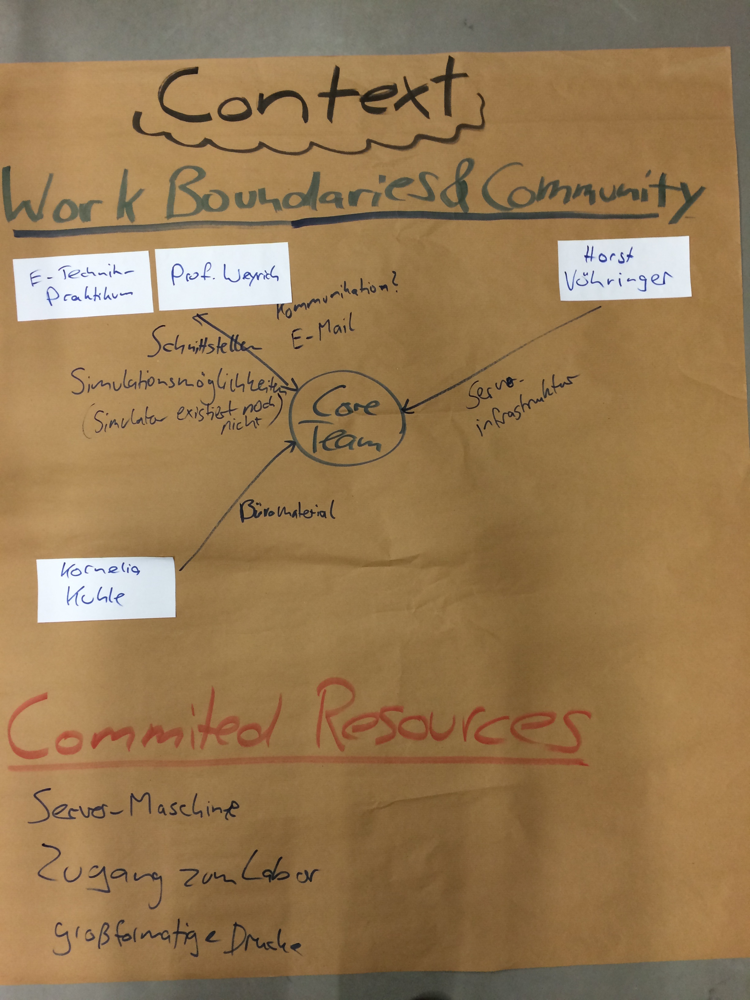
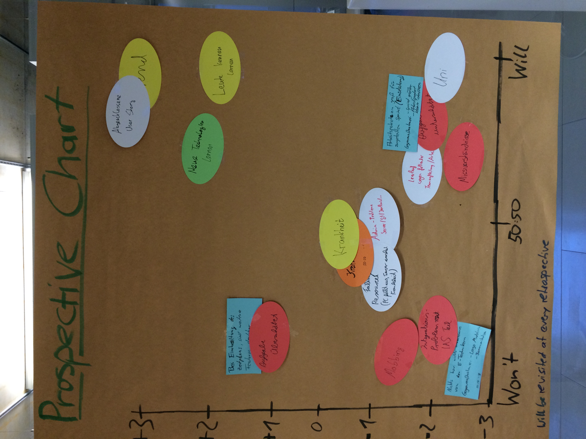

# Internet of Things (IoT) Project Charter

This is the charter of the development project *Internet of Things* of the MSc Softwaretechnik winter semester 2014/15 at the University of Stuttgart. It describes the *purpose* of the project, the *alignment* of the project with that purpose and the project's *context*.

## Puropose

### Vision
The product enables a number of realistic Internet of Things scenarios which can be studied and extended easily. We want to be able to investigate how new scenarios can be added to the Internet of Things (IoT). We will have an IoT  environment which can work with simulated and actual devices focusing on the communication between smartphones and different devices directly and over the cloud. For example, we will simulate a car computer unit and house electronic devices. Devices communicate and control each other in a secure and safe way. A mobile application and a web site are main controllers.

### Mission
For the software engineering research community, in particular the Software Engineering group at the University of Stuttgart, the IoT project will develop and deploy an IoT platform. It will be made available as open source. The platform should be of high-quality and easily extendible. It should include at least a mobile application, a cloud service with Web interface and interfaces to a car and house electronics (simulator).

### Mission Tests

* For a new developer, understanding the platform and integrating a new, simple scenario does not take more than two person-weeks of effort.
* The communication is encrypted.
* A non-authorised user cannot access data in the platform.
* Clone Coverage over the whole code is < 10%.
* The statement test coverage will be > 70%.
* 4 scenarios implemented as integration tests run successfully.
* The IoT platform will be used in research work that is published within a year.
* Another research group uses the simulation environment within a year.

## Alignment

### Values and Principles

#### Teamwork
We solve problems together.

#### Communication
We communicate openly and regularly and give constructive feedback.

#### Simplicity
We keep it small and simple.

#### Flexibility
We stay flexible and open regarding the goals, requirements and technologies of the project.

### Core Team Members

* Dirk Braunschweiger
* Philipp Keck
* Christian Bäumlisberger
* Sven Schnaible
* Christoph Ebbers
* Jonas Tangermann
* Florian Gänßlen
* Rocco Schulz
* Marcel Lehwald
* Benedikt Giesel
* Niklas Schnabel
* Ana Franco da Silva
* Asim Abdulkhaleq (Product Owner)
* Prof. Dr. Stefan Wagner (Scrum Master and Sponsor)

### Working Agreements

* We define *Done* for our stories as:
  * Every artefact is reviewed by 1-3 team members.
  * Code is tested.
  * Code is documented.
  * Acceptance criteria are fulfilled.
* We hold weekly standup meetings on Monday 10:30-11:00. During the semester, everyone has to attend in person. During the holidays, Skype is also acceptable. The meeting is no longer than 30 minutes. The whole core team is present.
* We have a sprint planning meeting on the first Monday of a sprint from 8:30-11-30.
* We hold our reviews and retrospectives on the last Friday of a sprint 10:00-11:00.
* We hold planning meetings for story-writing sessions, team creation and backlog grooming.
* We use Gitlab as versioning system and Jenkins as CI. We communicate using a mailing list. We might use Teamscale and Jira.
* We write all textual documents in Markdown.
* The sprint length is four weeks.
* The students work 40% of their available time on the project.
* Subteams decide for their assigned tasks; others may give input.

## Context

### Work Boundaries

* Practical course of the electrical engineers
* Prof. Dr. Michael Weyrich (IAS)
* Herr Jazdi (IAS)
* Herr Faul (IAS)
* Horst Vöhringer (SE system administrator)
* Kornelia Kuhle (PS/SE secretary)

### Project Community

### Commited Resources

* 360 hours of work per student over about 18 weeks (is roughly 50% of the time)
* At least weakly access to product owner
* Server
* Access to the lab
* Printing on larger scale, if necessary

### Prospective

