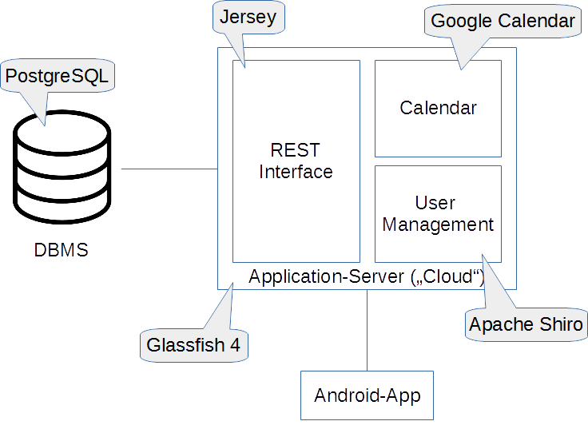

# Technology Choice

For securing a RESTful API, a framework is needed in order to avoid implementing everything by ourselfes. With this aproach we hope to avoid common mistakes concerning the security and rely more on the knowledge of the experts who wrote a security library. The focus on choosing a framework lies on easy usage and good security features.

As platform **Java** is used, because it is also used for the implementation of the cloud server. Furthermore everything runs in the applicaton server **Glassfish 4** and is using the JAX-RS implementation **Jersey**.

An overview over the system and the technolgy choices can be seen in the following graphic:

## Possible Security Methods

### Basic Authentication
Basic Authentication is as implied by the name the most basic possible solution. Using this method the **username and password** of the users are **Base64 encoded** and are send with every request to the server. This method relies completly on the encryption of the connection. Using an unencrypted connection is not recommended, because the decoding of the username/password combination can easily be achieved. Because of this limitations we decided **not to choose this method of authentication**.

### Sessions
A common way of authentication is the usage of a server side session, which indicates the login status of an user. This method is safer than the basic authentication, but it is a bad practice to use sessions in combination with an RESTful service. The reason of this is, that a **RESTful service should be stateless** and sessions introduce a state for an user. To comply with this best practice we **do not use session for authentication**.

### Bearer Token
A bearer token is an alphanumeric string, which is as unique as possible. As a concrete protocol that is is using such a token we found OAuth2. OAuth2 is an open standard for authorization and is commonly used as way for clients to log into a third party website using for example a Google, Facebook or Twitter account. 

More details on how authenticaton with a bearer token works can be found in the authentication document, because **this is the method we found most suitable**.

## Frameworks

After some research we found three frameworks, which could be used for a bearer token implementation.

### [Apache CXF](http://cxf.apache.org/) 
CXF is a fullly featured Web service framework. For this project important features are a implementation of JAX-RS, which is an API for RESTful services and the support of [OAuth2](http://cxf.apache.org/docs/jax-rs-oauth2.html). 

We chose this framework for further evaluation, because of the OAuth2 support and the good documentation. For further evaluation we tried to implement a small demo. At first it seemed simple, but in the end implemenation was quite complicated and we did not achieve to get it working.

### [Java Authentication and Authorization Service (JAAS)](http://www.oracle.com/technetwork/java/javase/jaas/index.html) 
JAAS is a security solution that is built into Java. After reading quite a lot about it, we came to the conclusion that the implementation of JAAS is very complicated and many people pointed towards Apache Shiro.

### [Apache Shiro](http://shiro.apache.org/) 
Shiro is a easy-to-use and still powerfull secuity framework for Java. It has a good documentation and delivers almost everything that is needed for a authentication with a bearer token. After a small demo implementation was working quite fast, the **easy usage was decisive for using this framework**.