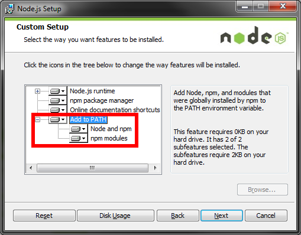

# RioT Webapp

## Prerequisites

The following sofware components are needed to setup the build environment:

 - [node](http://nodejs.org/)
 - [npm](https://www.npmjs.com/)
 - [grunt](http://gruntjs.com/)
 - [bower](http://bower.io/)
 - [Yeoman](http://yeoman.io/)

### Install on Linux

    sudo apt-get install nodejs
    sudo apt-get install npm
    sudo npm install -g grunt-cli
    sudo npm install -g bower
    sudo npm install -g yo

It may be necessary to install the legacy package of node with the following command.

    sudo apt-get install nodejs-legacy

### Install on Windows

 - Downlod the [installer](http://nodejs.org/download/) (the .msi package)
 - **Important:** Node has to be added to the `PATH` in Windows. See the following image:

After the installation is complete:

    npm install -g grunt-cli
    npm install -g bower
    npm install -g yo

It may be necessary to add the `NODE_PATH` variable to your path in order to install `yo`: 

    setx NODE_PATH "%NODE_PATH%;C:\Users\<YOUR USERNAME>\AppData\Roaming\npm\node_modules"

## Development

### Setup

Run the following commands in the root directory of the webapp to load the required dependencies.

    npm install
    bower install

## Project Structure

The project follows the best practice guidelines for AngularJS where specific functions are grouped together into a component. Each component consists of its own folder which contains the necessary angular views, controllers, directives, tests and much more. A component can further be separated into sub-components. This structure allows a clean development process where developers should firstly consider the separation of concern before developing and create new components accordingly.

### Grunt

The project uses [grunt](http://gruntjs.com/) for performing repetitive tasks like minification, compilation and unit testing. The following grunt tasks are available:

 - grunt **build**: Build the project. This will create the project in the *dist* directory, ready for deployment on the server.
 - grunt **serve**: This is the main task which should be used during development. The task will start a webserver and watch any changes on the files. Use [Livereaload](http://livereload.com/) to automatically reload the website on changes.
 - grunt **test**: Run the unit tests.

### Yeoman
For further automation the [Yeoman](http://yeoman.io/) project is used. The project structure uses the [cg-angular](https://github.com/cgross/generator-cg-angular) which has additional generators for adding new angular views, directives, filters and much more. Read the github page of the angular generator for further details.

This means for common tasks you will simply run a command and don't need to create and integrate the files manually.
